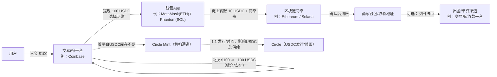
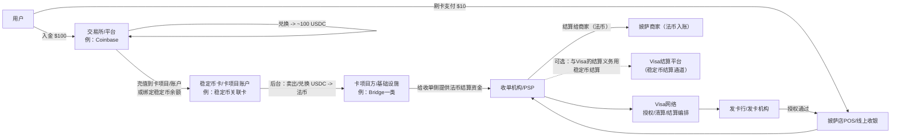
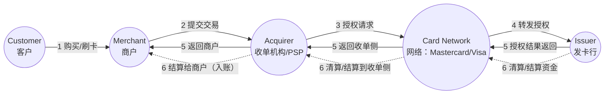
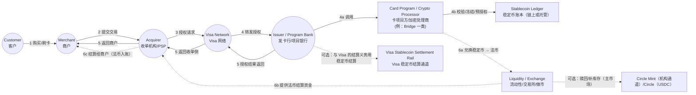
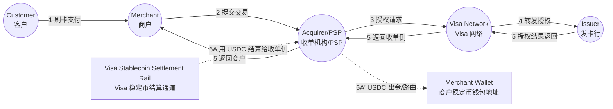
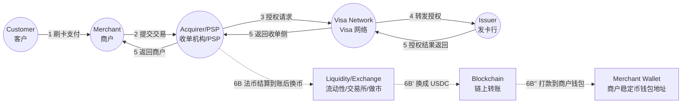
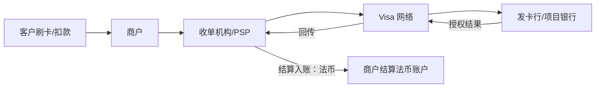
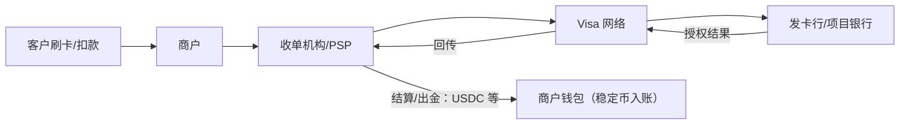

# 稳定币价值链与支付落地：以 USDC / USDT / PYUSD / USDG 为例（买方研究笔记）

> 目的：用买方视角把“稳定币从发行到支付落地”的关键参与者、分工、资金与信息流讲清，并为跟踪 Visa / Circle / PayPal / Coinbase 等生态公司提供框架。
>
> 资料口径：文末“参考来源（可核查）”为主要依据；最后核对时间见文末。本文仅用于研究讨论，不构成投资建议。

## 1. 执行摘要

- **Circle（以 USDC 为例）**：负责稳定币的发行与赎回（mint/burn）体系，以及与储备/兑付相关的制度与运营；主市场多通过机构通道完成。
- **Coinbase（以及其他交易所/钱包/经纪平台）**：更接近“分发入口与流动性中心”——为用户提供买卖、托管、出入金与链上提现等能力；同时在库存不足时可能通过主市场补库存。
- **Visa**：更接近“支付网络与结算编排者”——前台提供刷卡受理与四方模型规则体系；后台可把稳定币接入其结算与出金（Visa Direct）能力，但通常不做稳定币发行与赎回。

> 关键区分：**主市场（mint/burn）**决定稳定币总供给变化；**二级市场（交易所买卖）**多数只改变持有人与价格，不一定改变总供给。

---

## 2. 价值链参与者清单

### 2.1 监管与合规框架（Regulators）
- **详细说明**：决定谁能发行/赎回、资金与制裁合规要求、信息披露/审计要求，以及支付/托管/收单/出金等环节的牌照边界。
- **一句话**：监管定义“能做什么、必须怎么做”。
- **主要参与者**：各司法辖区金融监管机构（央行/金监部门）、支付监管机构、反洗钱与制裁合规相关机构；欧盟侧的 MiCA/MiCAR 框架相关机构（如 EBA 等）。

### 2.2 发行方 / 赎回方（Issuer / Redeemer）
- **详细说明**：负责稳定币的 mint/burn、储备与赎回机制；普通用户多数通过二级市场或平台入口间接使用，并不直接触达主市场。
- **一句话**：决定稳定币“发行/销毁（供给变化）”的总开关。
- **主要参与者**：Circle（USDC/EURC 体系）、Tether（USDT 体系）、Paxos（PYUSD、USDG 相关）。

### 2.3 主市场机构通道（Mint/Redeem Channel）
- **详细说明**：面向合格机构（交易所、做市商、部分金融机构等）的发行/赎回 API/账户体系，把“法币 ↔ 稳定币（链上）”做成可规模化的批发通道。
- **一句话**：主市场通道把稳定币的“批发进出”标准化。
- **主要参与者**：Circle Mint；Tether 官方赎回/发行流程入口；Paxos（PYUSD/USDG）相关的 mint/redeem 文档与通道。

### 2.4 储备资产管理人 / 托管人 / 现金存放银行（Reserve & Custody）
- **详细说明**：稳定币信用的底座是储备资产与托管安排（现金、短久期国债、回购/货币市场工具等）以及赎回流动性管理；这决定了压力情景下能否稳定兑回。
- **一句话**：储备与托管决定“能不能安全、稳定地 1:1 兑回”。
- **主要参与者**：托管银行/现金存放银行、国债/回购/货币市场工具的资产管理与托管体系、发行方的储备管理与风控团队。

### 2.5 审计 / 鉴证与披露（Audit / Attestation / Reporting）
- **详细说明**：通过独立审计/鉴证与定期披露降低信息不对称，增强市场信任；披露频率与口径差异会直接影响机构可用性与风险定价。
- **一句话**：把“信任”变成可核查的报告。
- **主要参与者**：第三方审计/鉴证机构；发行方透明度披露页面与报告体系（如 Circle 透明度披露、Paxos 透明度披露、Tether 储备报告披露）。

### 2.6 二级市场：交易所、经纪与做市商（Exchanges / Brokers / Market Makers）
- **详细说明**：多数用户换到稳定币发生在二级市场（撮合交易、库存/做市提供流动性）；二级市场交易通常不直接改变稳定币总供给，但会改变持有人与短期价格偏离。
- **一句话**：二级市场负责“随时可买卖 + 价格紧贴锚定”。
- **主要参与者**：交易所/经纪平台（如 Coinbase 等）、做市商/流动性提供者。

### 2.7 钱包与托管（Wallets / Custodians）
- **详细说明**：
  - **自托管钱包**：用户自己持有私钥（典型：MetaMask、Phantom 等）。
  - **平台托管**：交易所/钱包 App 帮你保管私钥或做账本余额。
- **一句话**：把链上资产变成用户可用的“账户体验”（自托管或平台托管）。
- **主要参与者**：自托管钱包（MetaMask、Phantom 等）、平台托管方（交易所/钱包 App 的托管与账户体系）。

### 2.8 区块链网络与基础设施（L1/L2, Nodes, RPC）
- **详细说明**：稳定币最终跑在链上；链决定费用、确认速度、最终性与可组合性；节点、RPC 与基础设施决定可用性与接入体验。
- **一句话**：区块链是“资金轨道”。
- **主要参与者**：公链与其基础设施（Ethereum、Solana 等；以及 Visa 披露支持/扩展的 Stellar、Avalanche 等）、节点/RPC/基础设施服务商。

### 2.9 支付受理与清算结算网络（Acquirers / PSPs / Networks）
- **详细说明**：商户受理侧（收单行/PSP/POS）与网络（如 Visa）负责授权、清算、结算编排；稳定币可在后台用于结算或出金，但商户端常常仍收法币（或由 PSP 提供稳定币入账产品）。
- **一句话**：把“链上资金形态”接入“现实商户的收款与对账”。
- **主要参与者**：卡网络（Visa；四方模型对照可类比 Mastercard）、收单机构/PSP（如 Worldpay、Nuvei；以及典型 PSP/收单方案如 Square、Stripe Terminal）、商户侧受理与对账系统。

### 2.10 出金与平台资金方（Payout Platforms / Employers / Marketplaces）
- **详细说明**：出金平台把“资金交付”做成能力（薪资、创作者分成、跨境收款等）；稳定币可用于预注资或直接打到稳定币钱包，提高 24x7 可用性与跨境效率。
- **一句话**：决定“稳定币用在哪些真实业务流里”。
- **主要参与者**：Visa Direct 这类出金平台；企业/雇主；平台型企业（marketplaces/内容平台等）；收款人侧钱包/托管账户。

### 2.11 多稳定币发行体系/发行基础设施商
- **详细说明**：不同稳定币发行体系（USDC、PYUSD、USDG 等）可能通过特定发行基础设施与合规体系进入同一支付/结算网络；这类“基础设施层”通常提供 API、合规集成、清结算/兑换对接等能力。
- **一句话**：让网络支持“多币种、多发行体系”的互操作。
- **主要参与者**：Paxos（PYUSD、USDG 相关体系）；加密支付处理商/基础设施（如 Bridge 一类）；以及面向银行/机构的代币化平台能力（如 Visa 披露的 VTAP）。

### 2.12 稳定币体系对照：USDC / USDT / PYUSD / USDG

| 维度 | USDC | USDT | PYUSD | USDG |
|---|---|---|---|---|
| 发行主体 | Circle | Tether | Paxos Trust Company（PayPal 入口） | Paxos Digital Singapore |
| 合规情况 | 合规/机构导向较强；以储备透明度与第三方鉴证作为信任基础 | 全球流通广，但在不同地区/机构的合规可接受度差异更大 | PayPal 品牌 + Paxos 受监管信托框架 | 更偏“面向机构/合规标准更高”的定位（具体监管口径以白皮书/官方披露为准） |
| 披露频率 | 周度披露 + 月度第三方鉴证 | 储备报告披露（常见为季度口径） | 月度储备报告/第三方鉴证 | 月度透明度/储备报告 |
| 生态入口 | 交易所/机构通道与结算场景较常见 | 交易所与跨境转账/新兴市场使用惯性强 | PayPal 钱包/商户网络分发 + 交易所合作分发 | 机构结算/收单/银行集成是关键（生态取决于伙伴落地） |
| 赎回入口 | 机构通常走 Circle Mint；零售多走二级市场 | 官方赎回流程（准入/流程以官网为准） | PayPal 端 1:1 赎回；并有透明度与机制披露入口 | 白皮书/开发文档披露 1:1 赎回与 mint/redeem 机制 |
| Visa 结算支持 | Visa 已公开披露支持 | Visa 结算平台公告中未被点名 | Visa 已公开披露支持 | Visa 已公开披露支持 |
| 商户接入示例 | Coinbase Commerce（可自动转换为 USDC 等） | BitPay（支持 USDT 收款） | BitPay（支持 PYUSD 收款） | 以公开披露为准；Visa 结算平台已点名支持 |


## 3. 用户视角：100 美元换稳定币 + 10 美元披萨（两条最常见路径）

> 设定：以 **USDC** 为例。

### 3.1 第一步：把 100 美元换成 ~100 USDC（入口阶段）

- 你在交易所/平台（例：Coinbase）入金 100 美元。
- 你用 100 美元买入 USDC：对你而言通常是 **二级市场撮合/平台库存交割**。
- **不必然**因为你这笔交易就触发 Circle 新增发行：只有当平台整体净需求导致 USDC 库存不足时，平台才可能去主市场（例如 Circle Mint）补库存，从而引发 mint（供给变化）。

### 3.2 第二步：你把 USDC 放在哪里（交易所账本 vs 链上钱包）

- **留在平台**：是平台账本里的 USDC 余额（方便交易/支付，但不是自持私钥）。
- **提到链上钱包**：选择链（Ethereum / Solana 等），把 USDC 提现到你控制的地址（自托管钱包如 MetaMask/Phantom）。

### 3.3 第三步：用 USDC 买 10 美元披萨

- **路径 A：链上直付**（商家直接收稳定币）
  - 商家通常通过收款平台（例：Coinbase Commerce / BitPay / Solana Pay 等）生成地址/二维码。
  - 你用钱包在链上转出 10 USDC（外加网络费）给商家。
  - 商家可选择继续持有 USDC 或换回法币。

- **路径 B：稳定币关联卡刷卡**（你用稳定币余额，但商家收法币）
  - 你用“稳定币关联的卡项目”在商户刷卡。
  - 后台由卡项目/基础设施将你的 USDC 兑换成商户要收的本地法币。
  - Visa 负责授权/清算/结算的网络编排；部分机构层结算可能引入稳定币，但对你刷卡体验通常无感。

---

## 4. 流程图

> 说明：以下流程图为“理解用示意图”，用于对照参与方与资金/信息流；具体落地会因地区、牌照、收单/PSP 产品设计而不同。

### 图 1：链上直付（商家直接收 USDC）



### 图 2：稳定币卡刷卡（稳定币在后台兑换，商家收法币）



### 图 3：四方模型（基线）（Mastercard 官网示意，重绘）
> 说明：下图为 Mastercard 官网 “Payment process” 页面中的经典四方模型流程图重绘（Customer → Merchant → Acquirer → Network → Issuer），便于与稳定币卡流程对照。


### 图 4：商家收法币（稳定币只在后台作为资金来源/兑换）
> 直观理解：前台仍是四方模型；不同点在于“发卡侧/卡项目方”在后台把用户稳定币余额（链上或平台托管账本）转换为商户所需法币，并完成清算/结算资金交付。


### 图 5A：商家收稳定币，通过 Visa 稳定币结算通道

> 直观理解：前台仍是 Visa 四方模型（授权/清算/结算编排）；差异在于**结算资产**——Visa 通过稳定币结算通道把 **USDC** 结算给收单机构/PSP，收单侧再把 USDC 出金/路由到商户的钱包地址。



### 图 5B：商家收稳定币，法币结算后由收单侧换币再出金

> 直观理解：前台仍是 Visa 四方模型；差异在于**入账前换币**——Visa/收单侧先按常规以法币结算，收单机构/PSP 再通过流动性渠道把法币换成 **USDC**，并链上转账到商户的钱包地址。



## 5. 路径对比：链上稳定币直付 vs. Visa 网络（商户结算法币 / 商户结算稳定币）

> 目的：把三条路径放到同一张框架里比较：**链上直付**、**刷卡但商户收法币**、**刷卡但商户收稳定币入账**。费用、体验与风控责任的差异，是判断“链上直付能否替代卡网络”的核心。

### 5.1 三种路径总览（同一笔 10 美元披萨）







### 5.2 关键差异对比

| 维度 | 链上稳定币直付（路径A） | Visa：商户结算法币（路径B） | Visa：商户结算稳定币（路径C） |
|---|---|---|---|
| 商户受理改造 | 需要：钱包/收款码/链选择/对账流程 | 低：沿用既有 POS/网关/PSP | 中：前台仍沿用卡受理，但收单/PSP 需提供稳定币入账产品 |
| 用户覆盖/支付习惯 | 取决于用户是否有钱包与稳定币 | 高：刷卡习惯成熟、覆盖广 | 高（前台同刷卡），对用户几乎无感 |
| 成本结构（直观） | 主要是链上手续费 + 出金/换汇成本（若需要法币） | 主要是卡费率/服务费（随地区/行业/卡种变化） | 介于两者：前台仍有卡网络成本，但商户可选择稳定币入账以优化跨境/资金周转（取决于产品定价） |
| 交易费（每笔显性手续费） | 链上费（实时波动）：ETH(ERC20)转账（Etherscan Gas Tracker：约`$0.02/笔`；2025-12-17）；SOL 基础费：`5000 lamports/签名`≈0.000005 SOL≈`$0.00064/笔`（按 SOL=$127.00）；收款平台费（示例）：Coinbase Commerce `1%`（$10→$0.10）；BitPay `1–2% + $0.25`（$10→$0.35–$0.45） | 卡侧费率（示例，随收单/PSP 定价）：Square 线下 `2.6% + $0.15`（$10→$0.41）；Stripe Terminal `2.7% + $0.05`（$10→$0.32） | 前台同路径B（卡侧费率同上）；商户“稳定币入账”阶段会产生链上出金费（同路径A示例）；另可能有换币点差/处理费（由收单/PSP 产品化定价，通常不公开统一价） |
| 示例：$10 显性手续费（按上行示例口径） | Coinbase Commerce（1%）+ ETH 转账≈$0.10 + $0.02 = `$0.12/笔`；BitPay（2%+$0.25）+ ETH 转账≈$0.45 + $0.02 = `$0.47/笔`（链上费实时波动） | Stripe Terminal≈`$0.32/笔`；Square≈`$0.41/笔` | 前台同路径B（`$0.32/笔`或`$0.41/笔`）+ 商户稳定币入账链上出金费（ETH 上约 +`$0.02/笔`；或更低的链）+ 可能的换币/出金服务费（通常由收单/PSP 定价，未统一公开） |
| 示例：$100 显性手续费（按上行示例口径） | Coinbase Commerce（1%）+ ETH 转账≈$1.00 + $0.02 = `$1.02/笔`；BitPay（2%+$0.25）+ ETH 转账≈$2.00 + $0.25 + $0.02 = `$2.27/笔`（链上费实时波动） | Stripe Terminal≈`$2.75/笔`（2.7%+$0.05）；Square≈`$2.75/笔`（2.6%+$0.15） | 前台同路径B（`$2.75/笔`）+ 商户稳定币入账链上出金费（ETH 上约 +`$0.02/笔`；或更低的链）+ 可能的换币/出金服务费（通常由收单/PSP 定价，未统一公开） |
| 示例：$500 显性手续费（按上行示例口径） | Coinbase Commerce（1%）+ ETH 转账≈$5.00 + $0.02 = `$5.02/笔`；BitPay（2%+$0.25）+ ETH 转账≈$10.00 + $0.25 + $0.02 = `$10.27/笔`（链上费实时波动） | Stripe Terminal≈`$13.55/笔`（2.7%+$0.05）；Square≈`$13.15/笔`（2.6%+$0.15） | 前台同路径B（Stripe：`$13.55/笔` 或 Square：`$13.15/笔`）+ 商户稳定币入账链上出金费（ETH 上约 +`$0.02/笔`；或更低的链）+ 可能的换币/出金服务费（通常由收单/PSP 定价，未统一公开） |
| 到账与最终性 | 链上确认后一般不可逆；最终性取决于链 | 规则体系内可退款/拒付；结算有批处理窗口 | 同路径B（授权规则不变）；但入账形态变为稳定币 |
| 争议处理/消费者保护 | 通常弱（更多靠商家客服与平台规则） | 强（网络规则、拒付/争议机制） | 强（前台仍是卡网络规则） |
| 欺诈/盗刷责任分配 | 更接近“私钥/地址自负”与平台风控 | 成熟：网络规则 + 收单/发卡/商户分担 | 同路径B（前台规则一致） |
| 会计/对账与税务 | 商户需建立链上对账与核算流程 | 标准化：对账/结算报表成熟 | 需额外处理：稳定币入账的核算/估值/出金（但可由 PSP 产品化） |
| 适用场景（倾向） | 加密原生、跨境小额、线上数字服务、愿意“即付即结” | 大众零售、线下、需要退款/拒付/分期等体验 | 跨境收款/资金周转、平台型商户、希望“前台刷卡覆盖 + 后台稳定币入账” |


### 5.2.1 不同稳定币对三条路径的影响

> 这部分只回答一个问题：当你把“USDC”替换成“USDT / PYUSD / USDG”时，三条路径里哪些环节会变、哪些不会。

- **路径A（链上直付）会变的点**：
  - 你能否把该稳定币提到链上、以及**能提到哪条链**（直接决定链上手续费与到账速度）。例如 PayPal 披露 PYUSD 可在 Ethereum/Solana 间选择转出。
  - 商户使用的收款 PSP 是否支持该币种与对应链（示例：BitPay 支持 USDT 与 PYUSD 用于发票收款）。
- **路径B（Visa：商户结算法币）通常不变的点**：
  - 前台仍是四方模型与卡规则；用户资金来源（你持有什么稳定币）更多影响的是**卡项目方/处理商**的换币与风控能力，而不是商户受理流程。
- **路径C（Visa：商户结算稳定币）会变的点**：
  - 关键在于 Visa 结算平台公开支持哪些稳定币作为结算资产：Visa 已披露支持 USDC，并新增支持 PYUSD、USDG；USDT 在 Visa 结算平台公告中未被点名。


> 注：路径C属于“卡网络前台 + 稳定币入账后台”的组合；它成立的基础是 Visa 已披露其稳定币结算能力，并在收单侧（例如 Worldpay、Nuvei）推进相关能力，且在部分场景披露了与银行伙伴的 USDC 结算。

### 5.3 什么时候“没必要走 Visa 网络”？什么时候仍然值得？

- **更可能不走 Visa（偏向路径A）**：
  - 商户愿意直接收币（有钱包、能对账、能处理链上收款客服）；
  - 交易以“不可逆、即时到账”为可接受前提；
  - 用户侧已经普遍持有稳定币/钱包，且场景对“刷卡覆盖/拒付机制/分期”依赖不强。

- **仍然值得走 Visa（偏向路径B）**：
  - 你要的是“最大化支付转化率与覆盖”（用户随手刷卡）；
  - 需要网络规则体系（争议/拒付/风控责任分配）；
  - 商户希望继续以本币法币入账，降低财务与运营复杂度。

- **两者兼得（偏向路径C）**：
  - 前台仍希望用刷卡覆盖用户；
  - 后台希望以稳定币入账以优化跨境/资金周转/24x7 结算可用性（具体能力落地依赖收单/PSP 产品设计与定价）。


---

## 6. 市场现状与增长驱动

### 6.1 市场规模与结构（以公开口径为准）

- **稳定币整体规模**：IMF（2025-10）指出稳定币总市值持续增长并 **突破 3,000 亿美元**。CoinDesk Data（2025-09）口径下，稳定币总市值约 **2,930 亿美元**。
- **头部集中度**：CoinDesk Data（2025-09）口径下，USDT 规模约 **1,720 亿美元**、市场份额 **58.8%**。
- **利率敏感性（决定发行方“储备收益”价值池）**：CoinDesk Data 给出示例口径：一次 **25bp 降息**可能使“前五大稳定币”合计年化收入减少约 **5 亿美元**（USDT 约 **3.25 亿美元**，USDC 约 **1.60 亿美元**）。

> 买方提示：当你把稳定币放进模型时，真正能驱动利润与估值重估的，往往是 **储备收益（利率）** 与 **分发/通道份额变化**，而不只是“市值”。

### 6.2 主要增长驱动

- **监管清晰度提升 → 机构采用增加**：IMF（2025-10）指出，美国的 GENIUS Act 通过与欧洲 MiCA 的应用，为机构采用提供了更清晰的路径。
- **结算与出金（payout）场景更先落地**：Visa 的公开披露显示，其稳定币布局更偏向 **结算可用性/资金调度效率** 与 **出金场景**，而非让零售消费者“直接用稳定币支付”。
- **商户侧“全成本”与可运营性是分水岭**：是否能做到低摩擦对账、风控、退款与税务处理，决定“链上直付”能否在商户侧规模化替代卡网络（与第 5 章呼应）。


## 7. 价值池与商业模式（谁赚什么钱）

> 写法口径：把“谁赚什么钱”拆成 5 件事：**客户是谁**、**谁付钱**、**怎么计费**、**主要成本项**、**稳定币带来什么变化**。

### 7.1 一张表看清：主要参与者的收费对象与计费方式（框架）

| 参与者 | 客户是谁 | 谁付钱（最终成本归属） | 怎么计费（常见形态） | 主要成本项 | 稳定币带来的变化（买方要点） |
|---|---|---|---|---|---|
| **发行方（Circle/USDC、Tether/USDT、Paxos/PYUSD、Paxos/USDG 等）** | 机构主市场客户、生态合作伙伴 | 主要来自储备收益；部分来自机构服务/合作分成（以披露为准） | 储备收益（利率敏感）+（可选）机构服务费/合作分成 | 托管/合规/运营、赎回流动性管理、渠道分成 | **最清晰的价值池：储备收益**；份额与合规可用性决定“默认结算资产”地位 |
| **交易所/经纪/托管入口（以 Coinbase 为例）** | 零售与机构用户、商户 | 用户/商户付费（交易、托管、出入金、商户产品） | 交易费/价差、托管/账户服务费、出入金/提现费、商户收款服务费（产品化定价） | 合规与风控、流动性/做市、基础设施与客服 | 稳定币越主流，越提升“入口活跃度”与商户收款需求；但多数时候并不直接拿储备收益 |
| **收单/PSP（Square/Stripe/Worldpay/Nuvei 等）** | 商户 | 商户付费（通常“一口价/全包价”） | 按金额百分比 + 每笔固定费；或更复杂的分层定价 | 需要向发卡行支付 interchange、向网络支付 network fees；还要承担风控/拒付/运营成本 | “商户收稳定币入账”会新增：换币点差/处理费 + 链上出金费 + 钱包/对账服务费（取决于产品设计） |
| **卡网络（Visa）** | 发卡行/收单机构/PSP（B2B 客户） | 由收单/发卡侧支付（最终通常体现在商户成本中） | 网络处理/评估/服务费；增值服务（风控、token、数据产品）；出金平台（Visa Direct）服务费 | 网络与风控基础设施成本；合规成本 | 稳定币更多是**结算资产与资金轨道扩展**：提升 24x7/跨境结算与出金能力，并增强客户粘性 |
| **发卡行/项目银行（Issuer/Program Bank）** | 持卡人（零售）与商户侧（间接） | interchange 主要由商户侧成本承担；也可能向持卡人收年费等 | interchange（按交易额/品类/卡种而变）+（可选）年费/利息/分期等 | 信用损失/欺诈损失、资金成本、运营与合规 | 稳定币卡项目的关键是：资金来源与换币/风控如何做；但发卡侧价值池仍主要由卡业务决定 |
| **加密支付处理商/基础设施（如 Bridge 一类）** | 卡项目方、平台、PSP | B2B 客户付费（项目方/平台/PSP） | API/处理费、换币服务费、账户/合规服务费（以披露为准） | 合规、清结算对接、流动性与风控 | 在“稳定币关联卡/商户稳定币入账”路径中承担关键的兑换/路由/合规集成 |

> 重要澄清：商户看到的费率（例如 Square/Stripe）通常是 **收单/PSP 的“全包报价”**，并不等同于“Visa 单独收费”。全包报价里会包含：**发卡行的 interchange + 网络费 + PSP 自己的服务费与风控成本**。

### 7.2 三条路径各自的“价值池归属”一眼看懂

- **路径 A：链上直付（商户直接收稳定币）**
  - 钱主要流向：链（网络费）+ 收款平台/支付处理商（如 Commerce/BitPay 的商户服务费）+（如需换回法币）交易所/做市/出金点差。
  - 谁“赚得最确定”：收款平台/支付处理商（商户服务费）与链（网络费）。

- **路径 B：刷卡但商户收法币（传统四方模型，稳定币在后台仅作为资金来源/兑换）**
  - 钱主要流向：发卡行/项目银行（interchange）+ Visa（网络费/服务费）+ 收单/PSP（商户服务费）。
  - 稳定币在哪赚钱：多发生在“后台换币/资金调度”环节（由项目方/处理商/流动性渠道获取点差或服务费）。

- **路径 C：刷卡但商户收稳定币入账**
  - 前台仍有：发卡行/项目银行（interchange）+ Visa（网络费/服务费）+ 收单/PSP（商户服务费）。
  - 额外新增：商户“稳定币入账”的换币/出金/对账服务费（由收单/PSP/处理商产品化定价）+ 链上出金费。
  - 买方判断关键：**新增费用能否被“跨境/资金周转/24x7 结算”的价值覆盖**，否则商户没有动力从 B 迁移到 C。

### 7.3 相关公司

#### 7.3.1 Circle（USDC）：最明确的是“储备收益”，其次是“合作伙伴通道与分成”（以披露为准）

- **钱从哪来**：储备收益（利率敏感）是最直观价值池；此外还可能存在与生态伙伴/渠道的合作分成与机构服务收入（需以披露与合同口径为准）。
- **成本与约束**：托管、合规、运营与赎回流动性管理。
- **稳定币竞争的本质**：当 Visa/收单/PSP 把稳定币“产品化”时，USDC 能否成为默认结算资产取决于合规可用性、流动性与伙伴覆盖。

#### 7.3.2 Visa：赚“网络与能力费”，稳定币更像结算轨道升级

- **钱从哪来**：网络处理/服务费 + 增值服务（风控、数据、token 等）+ Visa Direct 出金能力服务费。
- **稳定币怎么影响**：更可能体现为提升客户粘性与扩展可服务场景（结算可用性、跨境资金调度、出金产品）。

#### 7.3.3 Coinbase：赚“入口活跃度”与“产品化服务费”（而非稳定币利息）

- **钱从哪来**：交易、托管、出入金、以及面向商户的收款/对账产品（如 Commerce）。
- **稳定币怎么影响**：稳定币越普及，越能提升平台内“现金等价物”的留存与周转，从而带动交易/出入金/商户收款等收入池。

#### 7.3.4 PayPal（PYUSD）：更像“提升网络闭环与交易量”的产品，而不是单独的利息生意

- **钱从哪来**：PayPal 的核心仍是支付网络的交易与服务费；PYUSD 更像降低摩擦、提升留存与频次的产品形态。PYUSD 的储备收益如何分配需以 PayPal/Paxos 的披露为准。


## 8. 合规与落地约束（按地区/角色拆解要点）

> 说明：下列为研究框架，不构成法律意见；不同国家/州/产品结构会显著影响牌照与合规边界。

### 8.1 欧盟：MiCA（MiCAR）对稳定币发行与服务商的约束（高层）

- EBA 指出：在 MiCA 框架下，**ART/EMT 发行方需要获得在欧盟开展相关活动的授权**。
- Central Bank of Ireland 对 MiCAR 的概述可作为欧盟监管框架入口。

### 8.2 美国（高层）：机构采用高度依赖监管清晰度与分工

- IMF（2025-10）将美国监管清晰化作为机构采用的推动因素之一。
- 买方落地视角：发行/赎回（主市场）、托管、支付受理（收单/PSP）、以及“出金/资金交付”往往分属不同合规边界；商业化路径经常取决于合作伙伴如何分工与持牌。


## 9. 竞争格局与对生态公司的影响（USDC vs USDT vs PYUSD vs USDG）

### 9.1 竞争主战场

- **交易所与跨境转账**：USDT 仍保持显著规模与份额领先。
- **合规可用的机构结算与支付网络合作**：USDC/PYUSD/USDG 更容易在“传统支付网络与金融机构点名支持”的叙事中获得增量（例如 Visa 公开披露对 USDC/PYUSD/USDG 的结算支持）。
- **分发入口**：PayPal 的优势在于消费级钱包与商户网络；Coinbase 的优势在于交易所分发与商户收款产品。

### 9.2 Visa 的“多币种支持”对 USDC 生态意味着什么？

- Visa 从更偏 USDC 的早期试点，扩展到支持 PYUSD、USDG、EURC，体现了 Visa 更像 **中立的结算轨道**。
- 买方解读：对 USDC 来说，护城河不只是“被支持”，还包括在收单/PSP 产品化时能否成为默认选项（合规可用性、流动性、伙伴覆盖与运营成熟度）。


## 10. 关键 KPI 与催化剂（建议建立跟踪表）

### 10.1 核心 KPI（按公司/生态）

- **Visa**：参与稳定币结算的伙伴名单与覆盖区域、结算平台支持的稳定币与链扩展节奏、Visa Direct 稳定币出金试点扩张。
- **Circle（USDC）**：USDC 供给与透明度披露节奏、主市场通道合作伙伴与可用性。
- **PayPal（PYUSD）**：月度透明度报告/鉴证持续性、链与生态集成节奏。
- **Coinbase**：Commerce 等商户产品的功能迭代与费率策略。

### 10.2 催化剂

- 监管落地或范围扩大（机构可用性显著提升）。
- 头部收单/PSP 大规模上线“商户稳定币入账”（改变第 5 章路径C的可得性）。
- 商户侧“全成本”出现确定性下降（尤其在跨境与出金场景）。


## 11. 风险清单

- **利率下行风险（发行方价值池）**：储备收益受利率影响；CoinDesk Data 给出降息对行业收入的示例敏感性。
- **监管与执法不确定性**：监管口径变化会直接影响发行/赎回、托管、收单/PSP 与跨境出金的可得性。
- **储备与兑付风险**：储备结构、托管安排与赎回流动性管理决定挤兑压力下的兑付质量；相关研究与监管讨论可作为核查入口。
- **链上与运营风险**：链拥堵、地址误转、私钥丢失、合约漏洞等会影响“直付/稳定币入账”路径的体验与可运营性（与第 5 章一致）。

# 附一：Visa 正在开展的稳定币业务（截至 2025-12-16）

> 说明：本附录为“业务线梳理 + 关键合作方 + 进展时间点”的学习总结。日期与表述以 Visa 及相关合作方公开新闻稿/官网披露为准；后续可能随监管与产品进展更新。
> 读者提示：附录按 Visa 公告口径整理，优先回答“Visa 做什么、不做什么；支持哪些稳定币/链；合作伙伴分别承担什么”。

## A. 稳定币结算（Settlement）：把稳定币接入 Visa 的清算/结算体系

### A1）做什么
- 让部分 **发卡行（issuer）** 与 **收单行/收单机构（acquirer/PSP）** 可以用稳定币与 Visa 进行结算（相当于把“结算资产”从纯法币扩展到“法币 + 稳定币”）。
- 目标是提升结算可用性（含周末/假日）与资金调度效率，并在传统支付轨与链上资产之间实现互操作。

### A2）支持哪些稳定币与区块链
- 稳定币：**USDC、EURC**（Circle 体系）；以及通过与 Paxos 合作支持的 **PYUSD、USDG**。
- 区块链网络（已披露支持/扩展支持）：**Ethereum、Solana、Stellar、Avalanche**。

### A3）代表性进展（按时间）
- **2023-09**：扩展到收单侧试点，点名 Worldpay、Nuvei；并披露引入 Solana（同时也提到 Ethereum）。
- **2025-07**：披露其结算平台升级为“多币种 + 多链”，新增 Stellar、Avalanche，并引入 EURC、PYUSD、USDG。
- **2025-12-16**：披露在美国推出 USDC 结算；首批参与银行包括 Cross River Bank、Lead Bank，并在 Solana 上开始以 USDC 与 Visa 结算。

### A4）这一条线里 Visa 的位置（一句话）
- **Visa 是结算编排者与接入方**：把稳定币“接入”自身结算体系，让银行/收单伙伴在与 Visa 结算时可选用稳定币。

---

## B. Visa Direct：把稳定币用到“跨境出金/发薪/平台打款”链路

### B1）稳定币预注资（Prefunding）试点
- **做什么**：机构/企业可用稳定币给 Visa Direct 资金池预注资（减少跨境业务对多地法币预备金的依赖）。
- **用户/收款人体验**：收款人一般仍可收本地法币（不要求收款人持有稳定币）。
- **披露时间点**：Visa 在 2025-09 的公开信息中披露该类试点，并提到后续扩展规划。

### B2）稳定币钱包直达出金（Payout to stablecoin wallet）试点
- **做什么**：平台/企业可通过 Visa Direct 把款直接发到收款人的稳定币钱包；资金方可仍以法币出资，收款人选择以 USDC 等稳定币收款。
- **披露时间点**：Visa 在 2025-11 的公开信息中披露该类试点，并提到后续推广规划。

### B3）这一条线里 Visa 的位置（一句话）
- **Visa 是“出金平台能力提供方”**：把稳定币作为资金来源或交付形态嵌入 Visa Direct 的出金链路。

---

## C. VTAP（Visa Tokenized Asset Platform）：面向银行的“法币上链/代币化存款/稳定币”平台

### C1）做什么
- 提供一套面向金融机构的发行、管理与集成能力，覆盖“发行/转移/赎回/生命周期管理”等环节（可用于 tokenized deposits、stablecoins 等）。

### C2）代表性合作方与进展
- Visa 披露 **BBVA** 在 VTAP 沙盒中测试相关能力，并规划后续在公共链（以太坊）上进行试点。

### C3）这一条线里 Visa 的位置（一句话）
- **Visa 是工具/平台提供商**：帮助银行把“法币与存款的链上形态”产品化，而非自己成为发行方。

---

## D. 稳定币关联卡（消费落地）：稳定币余额在后台换成商户所需法币

### D1）做什么
- 用户持有稳定币余额，但在商户侧（通常）仍以法币结算：刷卡时由卡项目/基础设施在后台完成“稳定币 → 法币”的兑换与结算资金提供。

### D2）代表性披露
- 媒体报道 Visa 与 Bridge 推出“稳定币关联 Visa 卡”，其模式核心就是后台把稳定币余额转换为商户需要的本地货币，从而在 Visa 商户网络内可用。

### D3）这一条线里 Visa 的位置（一句话）
- **Visa 是消费受理网络与结算编排者**：让“稳定币资金来源”以卡支付形态无感进入商户受理体系。

---

## E. 稳定币咨询与生态（非交易/非发行）

- Visa 也披露推出稳定币相关咨询能力（教育、落地规划、生态对接），用于帮助机构客户理解与部署稳定币在结算、出金与支付中的用例。

---

## F. 合作伙伴与分工（速查表）

- **Circle**：USDC / EURC 体系（稳定币发行与赎回通道、储备/兑付体系）；也是 Visa USDC 结算能力的重要合作方。
- **Paxos**：Visa 结算平台中对 **PYUSD、USDG** 的支持由其合作引入（发行/合规/基础设施依币种而定）。
- **Worldpay、Nuvei**：收单侧/支付服务商试点伙伴（收单结算链路的一端）。
- **Crypto.com**：早期发行侧试点伙伴之一（与 Visa 结算相关的用例披露）。
- **Cross River Bank、Lead Bank**：Visa 披露的美国 USDC 结算首批银行伙伴。
- **BBVA**：VTAP 试点披露合作银行。
- **Bridge（媒体披露）**：稳定币关联卡的后台基础设施与兑换/结算资金支持。

---

## G. 一句话总结（把 Visa 放回价值链）

- **Visa 不做稳定币发行/赎回**；它主要做三件事：
  1) 把稳定币接入自己的 **结算层（Settlement）**；
  2) 在 **Visa Direct** 里提供“预注资/钱包直达”的稳定币出金能力；
  3) 通过“稳定币关联卡”等形态，让稳定币资金来源在后台完成兑换后进入商户受理网络。

# FAQ（持续更新）

## Q1：从“货币创造与销毁”的角度，Circle 像央行、Coinbase 像商业银行吗？

结论：这个类比有启发性，但不能直接等同；更准确的理解是“Circle 控制 USDC 的 mint/burn（供给变化），Coinbase 多数时候提供二级市场分发/交易/托管入口（改变持有人，不一定改变总供给）”。

**相似点**
- USDC 总量的扩张/收缩，确实对应“发行（mint）/赎回销毁（burn）”这一套机制；从宏观视角看有点像“供给开关”。
- Coinbase 等平台面向用户提供“买卖、持有、转账、提现到链上”等入口体验，外观上像“账户入口”。

**关键差异**
- Circle 不是央行：它不发行法币、也不做货币政策；USDC 更像“可按 1:1 兑回的私人负债/凭证”，供给扩张通常需要先进入等额准备金。
- Coinbase 通常不是商业银行：其核心是交易撮合/托管与出入金通道，不等同于“通过放贷创造存款”的信用创造机制。
- 主市场 vs 二级市场不同：Circle mint/burn 属于主市场（影响总供给）；你在 Coinbase 买卖多数是二级市场（主要改变持有人）。
- 风险与保障不同：平台余额/托管资产一般不等同于受存款保险保护的银行存款（是否受保护取决于司法辖区与具体产品结构）。

**更贴近的类比**
  - Circle：更像“100%准备金的稳定币发行人 + 赎回结算代理（把美元代币化）”。
  - Coinbase：更像“交易所/券商 + 托管人 + 零售入口（必要时连接主市场补库存）”。

备注：后续有更多问题可继续追加到本 FAQ。


## Q2：如果商家“收稳定币”，也可以走 Visa 卡四方模型网络吗？

结论：**分两种情况**。

1) **顾客用稳定币在链上直接付款（商家地址收币）**：
- 这通常 **不走 Visa 四方模型**，而是“链上转账/加密支付通道”（可以把 Visa 理解为完全不在这条链路上）。

2) **顾客仍然刷 Visa 卡，但商家希望最终“入账稳定币”（而不是法币）**：
- 这在产品形态上是可以成立的：前台仍是 Visa 四方模型（授权/清算/结算流程不变），但在**结算/出金环节**，由收单机构/PSP 把应收款以 **USDC 等稳定币** 形式打给商户钱包。
- Visa 曾公开披露：Visa 可用 USDC 向 Worldpay、Nuvei 做结算付款，而它们再把 USDC 路由给其“终端商户（end merchants）”。
- 另一个更“上游”的形态是：发卡行/收单行与 Visa 之间的 VisaNet 结算义务本身以 USDC 结算（机构侧的结算资产选择），这也为商户侧“收稳定币”提供了基础设施可能性，但是否落到商户层取决于收单伙伴的产品设计。

对照提醒：你前面提到的“稳定币关联卡”更常见的版本其实是**顾客侧用稳定币余额，商户侧仍收法币**（后台把稳定币换成法币给商户入账）。这与“商户收稳定币”正好相反。

# 参考来源

> 最后核对时间：2025-12-17（链接与页面结构可能更新，建议你在需要引用时再次打开核对原文）。

**来源 1：Mastercard 四方模型（Payment process）**
```
https://www.mastercard.com.hk/en-hk/business/merchants/start-accepting/payment-process.html
```

**来源 2：Visa 扩展稳定币结算到收单侧（并引入 Solana；点名 Worldpay、Nuvei）— 2023-09-05（Investor Relations）**
```
https://investor.visa.com/news/news-details/2023/Visa-Expands-Stablecoin-Settlement-Capabilities-to-Merchant-Acquirers/default.aspx
```

**来源 3：Visa 扩展稳定币结算支持（新增 EURC、PYUSD、USDG；新增 Stellar、Avalanche）— 2025-07-31（Investor Relations）**
```
https://investor.visa.com/news/news-details/2025/Visa-Expands-Stablecoin-Settlement-Support/default.aspx
```

**来源 4：Visa 在美国推出 USDC 稳定币结算（提及 Cross River Bank、Lead Bank、Solana）— 2025-12-16（Investor Relations）**
```
https://investor.visa.com/news/news-details/2025/Visa-Launches-Stablecoin-Settlement-in-the-United-States-Marking-a-Breakthrough-for-Stablecoin-Integration/default.aspx
```

**来源 5：Visa Direct 稳定币“预注资（prefunding）”试点 — 2025-09-30（Visa Newsroom）**
```
https://usa.visa.com/about-visa/newsroom/press-releases.releaseId.21696.html
```

**来源 6：Visa Direct 稳定币“钱包直达出金（payouts to stablecoin wallets）”试点 — 2025-11-12（Investor Relations）**
```
https://investor.visa.com/news/news-details/2025/Visa-Direct-Stablecoin-Payouts-Pilot-Speeds-Up-Access-to-Funds-for-Creators--Gig-Workers/default.aspx
```

**来源 7：Visa 推出 VTAP（Visa Tokenized Asset Platform），并披露 BBVA 试点 — 2024-10-03（Visa Newsroom）**
```
https://usa.visa.com/about-visa/newsroom/press-releases.releaseId.20881.html
```

**来源 8：Visa 与 Bridge 合作推出稳定币关联 Visa 卡能力 — 2025-04-30（Investor Relations）**
```
https://investor.visa.com/news/news-details/2025/Visa-and-Bridge-Partner-to-Make-Stablecoins-Accessible-for-Everyday-Purchases/default.aspx
```


**来源 9：Circle USDC 透明度页面（周度披露储备 + 月度第三方鉴证）**
```
https://www.circle.com/transparency
```

**来源 10：Circle Mint（机构主市场：USDC/EURC 发行与赎回通道）**
```
https://www.circle.com/circle-mint
```

**来源 11：Tether Transparency（储备报告披露频率：通常按季度发布；并可按链查看流通指标）**
```
https://tether.to/transparency/?tab=reports
```

**来源 12：Tether 赎回到法币（官方指引/流程页面，用于理解主市场赎回路径）**
```
https://tether.to/ru/redeem-tethers-to-fiat-currency/
```

**来源 13：PayPal PYUSD 产品说明（1:1 赎回 + 月度储备报告/鉴证提示）**
```
https://www.paypal.com/us/digital-wallet/manage-money/crypto/pyusd
```

**来源 14：Paxos PYUSD 透明度页面（月度储备报告/鉴证入口）**
```
https://www.paxos.com/pyusd-transparency
```

**来源 15：PayPal Newsroom：PYUSD 上 Solana（并披露可在 Ethereum/Solana 选择转出）— 2024-05-29**
```
https://newsroom.paypal-corp.com/2024-05-29-PayPal-USD-Stablecoin-Now-Available-on-Solana-Blockchain%2C-Providing-Faster%2C-Cheaper-Transactions-for-Consumers
```

**来源 16：Paxos USDG 透明度页面（月度储备报告/鉴证入口）**
```
https://www.paxos.com/usdg-transparency
```

**来源 17：Paxos Newsroom：Paxos Introduces Global Dollar (USDG)（发行主体/储备银行伙伴等披露）— 2024-10-31**
```
https://www.paxos.com/newsroom/paxos-introduces-global-dollar-usdg
```

**来源 18：USDG Whitepaper（PDF：发行主体、监管框架与设计）— 2024-10-25**
```
https://424565.fs1.hubspotusercontent-na1.net/hubfs/424565/USDGWhitePaper.pdf
```

**来源 19：Paxos Developer Docs：USDG Overview（1:1 赎回与 mint/redeem 指引入口）**
```
https://docs.paxos.com/guides/stablecoin/usdg
```

**来源 20：BitPay：支持的加密资产列表（含 USDT、PYUSD 等）— 2025-06-17 更新**
```
https://support.bitpay.com/hc/en-us/articles/37436300598157-List-of-Supported-Cryptocurrencies-and-Associated-White-Papers
```

**来源 21：Coinbase Commerce（商户收款：可自动转换为 USDC 的产品说明）**
```
https://www.coinbase.com/commerce
```

**来源 22：CoinDesk Data — Stablecoins & CBDCs Report（2025-09；含稳定币市值、USDT 份额与利率敏感性示例）**
```
https://data.coindesk.com/reports/stablecoins-cbdcs-report-september-2025
```

**来源 23：IMF — Crypto Assets Monitor（2025-10 PDF；提到稳定币市值突破 3,000 亿美元与监管推动因素）**
```
https://www.imfconnect.org/content/dam/imf/News%20and%20Generic%20Content/GMM/Special%20Features/GMM%20Special%20Feature%20-%20Crypto%20Monitor%20October%202025.pdf
```

**来源 24：S&P Global Ratings — Stablecoins, Financial Stability, And Treasuries（2025-12；关于稳定币与美债/金融稳定的研究入口）**
```
https://www.spglobal.com/ratings/en/regulatory/article/stablecoins-financial-stability-and-treasuries-whats-next-for-money-and-safe-assets-s101659822
```

**来源 25：ECB Financial Stability Review Focus — Stablecoins on the rise（2025-11；讨论稳定币增长与金融稳定关注点）**
```
https://www.ecb.europa.eu/press/financial-stability-publications/fsr/focus/2025/html/ecb.fsrbox202511_05~63636227b4.en.html
```

**来源 26：EBA — Asset-referenced and e-money tokens (MiCA)（欧盟对 ART/EMT 发行方授权要求入口）**
```
https://www.eba.europa.eu/regulation-and-policy/asset-referenced-and-e-money-tokens-mica
```

**来源 27：Central Bank of Ireland — Markets in Crypto-Assets Regulation (MiCAR)（MiCAR 监管框架概述入口）**
```
https://www.centralbank.ie/regulation/markets-in-crypto-assets-regulation
```
