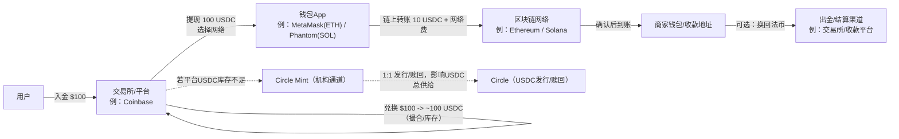
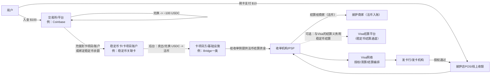
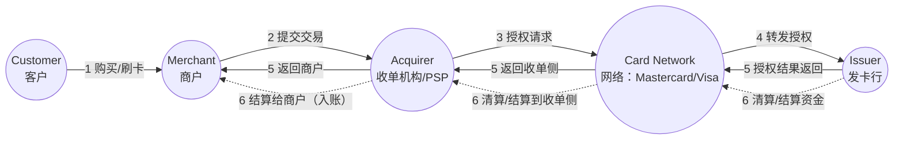
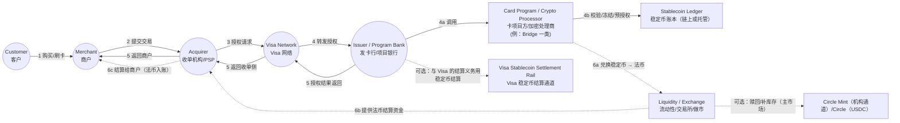
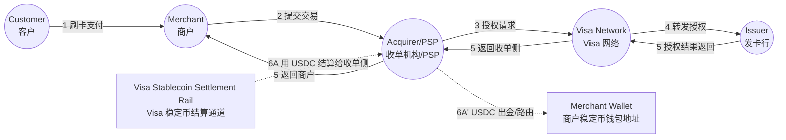
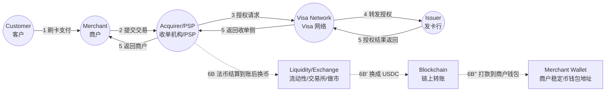
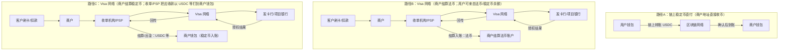

# 稳定币价值链（以 USDC/USDT 等为例）学习笔记

> 目的：把“稳定币从发行到最终支付落地”的参与者、职责与典型路径一次性讲清。

## 1. 一句话总览

- **Circle（以 USDC 为例）**：发行与赎回（mint/burn）的核心机构通道与兑付机制提供方。
- **Coinbase（以及其他交易所/钱包平台）**：面向用户的分发入口、交易撮合与（平台型）托管场景的重要参与者之一。
- **Visa**：支付网络/清算结算的编排者 + 结算层的稳定币接入方 + 出金平台（Visa Direct）的稳定币能力提供方（通常不做发行与赎回，也通常不做面向零售用户的交易所/托管入口）。

> 精确化提示：Coinbase 很关键，但不是唯一分发与托管入口；稳定币的“上链供给变化”发生在发行/赎回（主市场）层面，普通用户在交易所买卖多数属于二级市场（只改变持有人，不一定改变总供给）。

---

## 2. 价值链参与者清单（详细说明 + 一句话解释）

### 2.1 监管与合规框架（Regulators）
- **详细说明**：决定谁能发行/赎回、资金与制裁合规要求、信息披露/审计要求、以及支付/托管的牌照边界。
- **一句话**：监管定义“能做什么、必须怎么做”。

### 2.2 发行方 / 赎回方（Issuer / Redeemer）
- **详细说明**：负责稳定币的 mint/burn、储备与赎回机制（例如 USDC 由 Circle 体系提供发行与赎回通道；普通用户通常不直接触达主市场）。
- **一句话**：发行方负责“供给如何扩张/收缩”的开关。

### 2.3 主市场机构通道（Mint/Redeem Channel）
- **详细说明**：面向合格机构（交易所、做市商、部分金融机构等）的发行/赎回 API/账户体系（例如 Circle Mint 这类）。
- **一句话**：主市场通道把“法币 ↔ 稳定币（链上）”做成可规模化的批发通道。

### 2.4 储备资产管理人 / 托管人 / 现金存放银行（Reserve & Custody）
- **详细说明**：稳定币信用的底座是储备资产与托管安排（现金、短久期国债、回购/货币市场工具等）以及赎回流动性管理。
- **一句话**：储备与托管决定“能不能安全、稳定地 1:1 兑回”。

### 2.5 审计 / 鉴证与披露（Audit / Attestation / Reporting）
- **详细说明**：通过独立审计/鉴证与定期披露降低信息不对称，增强市场信任。
- **一句话**：把“信任”变成可核查的报告。

### 2.6 二级市场：交易所、经纪与做市商（Exchanges / Brokers / Market Makers）
- **详细说明**：大多数用户换到稳定币发生在二级市场（撮合交易、库存/做市提供流动性）。这类交易通常不直接改变稳定币总供给。
- **一句话**：二级市场负责“随时可买卖 + 价格紧贴锚定”。

### 2.7 钱包与托管（Wallets / Custodians）
- **详细说明**：
  - **自托管钱包**：用户自己持有私钥（典型：MetaMask、Phantom 等）。
  - **平台托管**：交易所/钱包App 帮你保管私钥或做账本余额。
- **一句话**：钱包/托管把链上资产变成“可持有、可操作、可风控”的账户体验。

### 2.8 区块链网络与基础设施（L1/L2, Nodes, RPC）
- **详细说明**：稳定币最终跑在链上（例如 Ethereum、Solana 等），链决定费用、确认速度、最终性与可组合性。
- **一句话**：区块链是“资金轨道”。

### 2.9 支付受理与清算结算网络（Acquirers / PSPs / Networks）
- **详细说明**：商户受理侧（收单行/PSP/POS）与网络（如 Visa）负责授权、清算、结算编排；稳定币可在后台用于结算或出金，但商户端常常仍收法币。
- **一句话**：把“链上价值”接到“现实商户资金流”。

### 2.10 出金与平台资金方（Payout Platforms / Employers / Marketplaces）
- **详细说明**：例如 Visa Direct 一类出金平台，可能把稳定币用于预注资或把款直接打到稳定币钱包；资金方决定场景（薪资、创作者分成、跨境收款等）。
- **一句话**：决定“稳定币用在哪些真实业务流里”。

### 2.11 多稳定币发行体系/发行基础设施商（如 Paxos 等）
- **详细说明**：不同稳定币发行体系（USDC、PYUSD、USDG 等）可能通过特定发行基础设施与合规体系进入同一支付/结算网络。
- **一句话**：让网络支持“多币种、多发行体系”的互操作。

---

## 3. 用户视角：100 美元换稳定币 + 10 美元披萨（两条最常见路径）

> 设定：以 **USDC** 为例。

### 3.1 第一步：把 100 美元换成 ~100 USDC（入口阶段）

- 你在交易所/平台（例：Coinbase）入金 100 美元。
- 你用 100 美元买入 USDC：对你而言通常是 **二级市场撮合/平台库存交割**。
- **不必然**因为你这笔交易就触发 Circle 新增发行：只有当平台整体净需求导致 USDC 库存不足时，平台才可能去主市场（例如 Circle Mint）补库存，从而引发 mint（供给变化）。

### 3.2 第二步：你把 USDC 放在哪里（交易所账本 vs 链上钱包）

- **留在平台**：是平台账本里的 USDC 余额（方便交易/支付，但不是自持私钥）。
- **提到链上钱包**：选择链（Ethereum / Solana 等），把 USDC 提现到你控制的地址（自托管钱包如 MetaMask/Phantom）。

### 3.3 第三步：用 USDC 买 10 美元披萨

- **路径 A：链上直付**（商家直接收稳定币）
  - 商家通常通过收款平台（例：Coinbase Commerce / BitPay / Solana Pay 等）生成地址/二维码。
  - 你用钱包在链上转出 10 USDC（外加网络费）给商家。
  - 商家可选择继续持有 USDC 或换回法币。

- **路径 B：稳定币关联卡刷卡**（你用稳定币余额，但商家收法币）
  - 你用“稳定币关联的卡项目”在商户刷卡。
  - 后台由卡项目/基础设施将你的 USDC 兑换成商户要收的本地法币。
  - Visa 负责授权/清算/结算的网络编排；部分机构层结算可能引入稳定币，但对你刷卡体验通常无感。

---

## 4. 流程图（Mermaid）

> 说明：以下为 **Mermaid** 文本流程图。支持 Mermaid 的 Markdown 编辑器/笔记工具可以直接渲染；否则可复制到 Mermaid Live Editor 渲染。

### 图 1：链上直付（商家直接收 USDC）



### 图 2：稳定币卡刷卡（稳定币在后台兑换，商家收法币）



### 图 3：四方模型（Mastercard 官网示例，Mermaid 重绘）
> 说明：下图为 Mastercard 官网 “Payment process” 页面中的经典四方模型流程图的 Mermaid 版本（Customer → Merchant → Acquirer → Network → Issuer），便于与稳定币卡流程对照。（来源 1）


### 图 4：用户用“稳定币 Visa 卡”买披萨，在四方模型上叠加稳定币侧链路（Mermaid）
> 直观理解：前台仍是四方模型；不同点在于“发卡侧/卡项目方”在后台把用户稳定币余额（链上或平台托管账本）转换为商户所需法币，并完成清算/结算资金交付。（与稳定币关联卡/Bridge 的披露见来源 8；与 Visa 稳定币结算能力披露见来源 2/3/4）


### 图 5A：顾客仍刷 Visa 卡，但商家最终“入账稳定币”——路径A（机构层以 USDC 结算到收单侧）

> 直观理解：前台仍是 Visa 四方模型（授权/清算/结算编排）；差异在于**结算资产**——Visa 通过稳定币结算通道把 **USDC** 结算给收单机构/PSP，收单侧再把 USDC 出金/路由到商户的钱包地址。



### 图 5B：顾客仍刷 Visa 卡，但商家最终“入账稳定币”——路径B（法币结算后由收单侧换币再出金）

> 直观理解：前台仍是 Visa 四方模型；差异在于**入账前换币**——Visa/收单侧先按常规以法币结算，收单机构/PSP 再通过流动性渠道把法币换成 **USDC**，并链上转账到商户的钱包地址。



## 5. 路径对比：链上稳定币直付 vs. Visa 网络（商户结算法币 / 商户结算稳定币）

> 目的：把“成本更低的链上直付”与“更高费用但更强的卡网络能力”放到同一张对比表里；同时把 Visa 网络内部再拆成两种商户入账形态：**商户收法币** vs **商户收稳定币（USDC 等）**。

### 5.1 三种路径总览（同一笔 10 美元披萨）



### 5.2 关键差异对比

| 维度 | 链上稳定币直付（路径A） | Visa：商户结算法币（路径B） | Visa：商户结算稳定币（路径C） |
|---|---|---|---|
| 商户受理改造 | 需要：钱包/收款码/链选择/对账流程 | 低：沿用既有 POS/网关/PSP | 中：前台仍沿用卡受理，但收单/PSP 需提供稳定币入账产品 |
| 用户覆盖/支付习惯 | 取决于用户是否有钱包与稳定币 | 高：刷卡习惯成熟、覆盖广 | 高（前台同刷卡），对用户几乎无感 |
| 成本结构（直观） | 主要是链上手续费 + 出金/换汇成本（若需要法币） | 主要是卡费率/服务费（随地区/行业/卡种变化） | 介于两者：前台仍有卡网络成本，但商户可选择稳定币入账以优化跨境/资金周转（取决于产品定价） |
| 交易费（每笔显性手续费） | **链上费（实时波动）**：ETH(ERC20)转账（Etherscan Gas Tracker：约 **$0.02/笔（平均）**；2025-12-17）；SOL 基础费 **5000 lamports/签名**≈0.000005 SOL≈**$0.00064/笔**（按 SOL=$127.00）<br/>**收款平台费（示例）**：Coinbase Commerce **1%**（$10→$0.10）；BitPay **1–2% + $0.25**（$10→$0.35–$0.45） | **卡侧费率（示例，随收单/PSP 定价）**：Square 线下 **2.6% + $0.15**（$10→$0.41）；Stripe Terminal **2.7% + $0.05**（$10→$0.32） | **前台同路径B**（卡侧费率同上）；另在“稳定币打款到商户钱包”阶段产生**链上费**（同路径A示例）；以及可能的**换币点差/处理费**（由收单/PSP 产品化定价，通常不公开统一价） |
| 到账与最终性 | 链上确认后一般不可逆；最终性取决于链 | 规则体系内可退款/拒付；结算有批处理窗口 | 同路径B（授权规则不变）；但入账形态变为稳定币 |
| 争议处理/消费者保护 | 通常弱（更多靠商家客服与平台规则） | 强（网络规则、拒付/争议机制） | 强（前台仍是卡网络规则） |
| 欺诈/盗刷责任分配 | 更接近“私钥/地址自负”与平台风控 | 成熟：网络规则 + 收单/发卡/商户分担 | 同路径B（前台规则一致） |
| 会计/对账与税务 | 商户需建立链上对账与核算流程 | 标准化：对账/结算报表成熟 | 需额外处理：稳定币入账的核算/估值/出金（但可由 PSP 产品化） |
| 适用场景（倾向） | 加密原生、跨境小额、线上数字服务、愿意“即付即结” | 大众零售、线下、需要退款/拒付/分期等体验 | 跨境收款/资金周转、平台型商户、希望“前台刷卡覆盖 + 后台稳定币入账” |

> 注：路径C属于“卡网络前台 + 稳定币入账后台”的组合；它成立的基础是 Visa 已披露其稳定币结算能力，并在收单侧（例如 Worldpay、Nuvei）推进相关能力（来源 2），且在部分场景披露了与银行伙伴的 USDC 结算（来源 4）。

### 5.3 什么时候“没必要走 Visa 网络”？什么时候仍然值得？

- **更可能不走 Visa（偏向路径A）**：
  - 商户愿意直接收币（有钱包、能对账、能处理链上收款客服）；
  - 交易以“不可逆、即时到账”为可接受前提；
  - 用户侧已经普遍持有稳定币/钱包，且场景对“刷卡覆盖/拒付机制/分期”依赖不强。

- **仍然值得走 Visa（偏向路径B）**：
  - 你要的是“最大化支付转化率与覆盖”（用户随手刷卡）；
  - 需要网络规则体系（争议/拒付/风控责任分配）；
  - 商户希望继续以本币法币入账，降低财务与运营复杂度。

- **两者兼得（偏向路径C）**：
  - 前台仍希望用刷卡覆盖用户；
  - 后台希望以稳定币入账以优化跨境/资金周转/24x7 结算可用性（具体能力落地依赖收单/PSP 产品设计与定价）。


# 附一：Visa 正在开展的稳定币业务（截至 2025-12-16）

> 说明：本附录为“业务线梳理 + 关键合作方 + 进展时间点”的学习总结。日期与表述以 Visa 及相关合作方公开新闻稿/官网披露为准；后续可能随监管与产品进展更新。

## A. 稳定币结算（Settlement）：把稳定币接入 Visa 的清算/结算体系

### A1）做什么
- 让部分 **发卡行（issuer）** 与 **收单行/收单机构（acquirer/PSP）** 可以用稳定币与 Visa 进行结算（相当于把“结算资产”从纯法币扩展到“法币 + 稳定币”）。
- 目标是提升结算可用性（含周末/假日）与资金调度效率，并在传统支付轨与链上资产之间实现互操作。

### A2）支持哪些稳定币与区块链
- 稳定币：**USDC、EURC**（Circle 体系）；以及通过与 Paxos 合作支持的 **PYUSD、USDG**。
- 区块链网络（已披露支持/扩展支持）：**Ethereum、Solana、Stellar、Avalanche**。

### A3）代表性进展（按时间）
- **2023-09**：扩展到收单侧试点，点名 Worldpay、Nuvei；并披露引入 Solana（同时也提到 Ethereum）。
- **2025-07**：披露其结算平台升级为“多币种 + 多链”，新增 Stellar、Avalanche，并引入 EURC、PYUSD、USDG。
- **2025-12-16**：披露在美国推出 USDC 结算；首批参与银行包括 Cross River Bank、Lead Bank，并在 Solana 上开始以 USDC 与 Visa 结算。

### A4）这一条线里 Visa 的位置（一句话）
- **Visa 是结算编排者与接入方**：把稳定币“接入”自身结算体系，让银行/收单伙伴在与 Visa 结算时可选用稳定币。

---

## B. Visa Direct：把稳定币用到“跨境出金/发薪/平台打款”链路

### B1）稳定币预注资（Prefunding）试点
- **做什么**：机构/企业可用稳定币给 Visa Direct 资金池预注资（减少跨境业务对多地法币预备金的依赖）。
- **用户/收款人体验**：收款人一般仍可收本地法币（不要求收款人持有稳定币）。
- **披露时间点**：Visa 在 2025-09 的公开信息中披露该类试点，并提到后续扩展规划。

### B2）稳定币钱包直达出金（Payout to stablecoin wallet）试点
- **做什么**：平台/企业可通过 Visa Direct 把款直接发到收款人的稳定币钱包；资金方可仍以法币出资，收款人选择以 USDC 等稳定币收款。
- **披露时间点**：Visa 在 2025-11 的公开信息中披露该类试点，并提到后续推广规划。

### B3）这一条线里 Visa 的位置（一句话）
- **Visa 是“出金平台能力提供方”**：把稳定币作为资金来源或交付形态嵌入 Visa Direct 的出金链路。

---

## C. VTAP（Visa Tokenized Asset Platform）：面向银行的“法币上链/代币化存款/稳定币”平台

### C1）做什么
- 提供一套面向金融机构的发行、管理与集成能力，覆盖“发行/转移/赎回/生命周期管理”等环节（可用于 tokenized deposits、stablecoins 等）。

### C2）代表性合作方与进展
- Visa 披露 **BBVA** 在 VTAP 沙盒中测试相关能力，并规划后续在公共链（以太坊）上进行试点。

### C3）这一条线里 Visa 的位置（一句话）
- **Visa 是工具/平台提供商**：帮助银行把“法币与存款的链上形态”产品化，而非自己成为发行方。

---

## D. 稳定币关联卡（消费落地）：稳定币余额在后台换成商户所需法币

### D1）做什么
- 用户持有稳定币余额，但在商户侧（通常）仍以法币结算：刷卡时由卡项目/基础设施在后台完成“稳定币 → 法币”的兑换与结算资金提供。

### D2）代表性披露
- 媒体报道 Visa 与 Bridge 推出“稳定币关联 Visa 卡”，其模式核心就是后台把稳定币余额转换为商户需要的本地货币，从而在 Visa 商户网络内可用。

### D3）这一条线里 Visa 的位置（一句话）
- **Visa 是消费受理网络与结算编排者**：让“稳定币资金来源”以卡支付形态无感进入商户受理体系。

---

## E. 稳定币咨询与生态（非交易/非发行）

- Visa 也披露推出稳定币相关咨询能力（教育、落地规划、生态对接），用于帮助机构客户理解与部署稳定币在结算、出金与支付中的用例。

---

## F. 合作伙伴与分工（速查表）

- **Circle**：USDC / EURC 体系（稳定币发行与赎回通道、储备/兑付体系）；也是 Visa USDC 结算能力的重要合作方。
- **Paxos**：Visa 结算平台中对 **PYUSD、USDG** 的支持由其合作引入（发行/合规/基础设施依币种而定）。
- **Worldpay、Nuvei**：收单侧/支付服务商试点伙伴（收单结算链路的一端）。
- **Crypto.com**：早期发行侧试点伙伴之一（与 Visa 结算相关的用例披露）。
- **Cross River Bank、Lead Bank**：Visa 披露的美国 USDC 结算首批银行伙伴。
- **BBVA**：VTAP 试点披露合作银行。
- **Bridge（媒体披露）**：稳定币关联卡的后台基础设施与兑换/结算资金支持。

---

## G. 一句话总结（把 Visa 放回价值链）

- **Visa 不做稳定币发行/赎回**；它主要做三件事：
  1) 把稳定币接入自己的 **结算层（Settlement）**；
  2) 在 **Visa Direct** 里提供“预注资/钱包直达”的稳定币出金能力；
  3) 通过“稳定币关联卡”等形态，让稳定币资金来源在后台完成兑换后进入商户受理网络。

# FAQ（持续更新）

## Q1：从“货币创造与销毁”的角度，Circle 像央行、Coinbase 像商业银行吗？

结论：这个类比有启发性，但不能直接等同；更准确的理解是“Circle 控制 USDC 的 mint/burn（供给变化），Coinbase 多数时候提供二级市场分发/交易/托管入口（改变持有人，不一定改变总供给）”。

**相似点**
- USDC 总量的扩张/收缩，确实对应“发行（mint）/赎回销毁（burn）”这一套机制；从宏观视角看有点像“供给开关”。
- Coinbase 等平台面向用户提供“买卖、持有、转账、提现到链上”等入口体验，外观上像“账户入口”。

**关键差异**
- Circle 不是央行：它不发行法币、也不做货币政策；USDC 更像“可按 1:1 兑回的私人负债/凭证”，供给扩张通常需要先进入等额准备金。
- Coinbase 通常不是商业银行：其核心是交易撮合/托管与出入金通道，不等同于“通过放贷创造存款”的信用创造机制。
- 主市场 vs 二级市场不同：Circle mint/burn 属于主市场（影响总供给）；你在 Coinbase 买卖多数是二级市场（主要改变持有人）。
- 风险与保障不同：平台余额/托管资产一般不等同于受存款保险保护的银行存款（是否受保护取决于司法辖区与具体产品结构）。

**更贴近的类比**
- Circle：更像“100%准备金的稳定币发行人 + 赎回结算代理（把美元代币化）”。
- Coinbase：更像“交易所/券商 + 托管人 + 零售入口（必要时连接主市场补库存）”。

备注：后续有更多问题可继续追加到本 FAQ。


## Q2：如果商家“收稳定币”，也可以走 Visa 卡四方模型网络吗？

结论：**分两种情况**。

1) **顾客用稳定币在链上直接付款（商家地址收币）**：
- 这通常 **不走 Visa 四方模型**，而是“链上转账/加密支付通道”（可以把 Visa 理解为完全不在这条链路上）。

2) **顾客仍然刷 Visa 卡，但商家希望最终“入账稳定币”（而不是法币）**：
- 这在产品形态上是可以成立的：前台仍是 Visa 四方模型（授权/清算/结算流程不变），但在**结算/出金环节**，由收单机构/PSP 把应收款以 **USDC 等稳定币** 形式打给商户钱包。
- Visa 已公开披露过：Visa 可用 USDC 向 Worldpay、Nuvei 做结算付款，而它们再把 USDC 路由给其“终端商户（end merchants）”。（来源 2）
- 另一个更“上游”的形态是：发卡行/收单行与 Visa 之间的 VisaNet 结算义务本身以 USDC 结算（机构侧的结算资产选择），这也为商户侧“收稳定币”提供了基础设施可能性，但是否落到商户层取决于收单伙伴的产品设计。（来源 4）

对照提醒：你前面提到的“稳定币关联卡”更常见的版本其实是**顾客侧用稳定币余额，商户侧仍收法币**（后台把稳定币换成法币给商户入账）。这与“商户收稳定币”正好相反。

# 参考来源（可核查）

> 最后核对时间：2025-12-17（链接与页面结构可能更新，建议你在需要引用时再次打开核对原文）。

**来源 1：Mastercard 四方模型（Payment process）**
```
https://www.mastercard.com.hk/en-hk/business/merchants/start-accepting/payment-process.html
```

**来源 2：Visa 扩展稳定币结算到收单侧（并引入 Solana；点名 Worldpay、Nuvei）— 2023-09-05（Investor Relations）**
```
https://investor.visa.com/news/news-details/2023/Visa-Expands-Stablecoin-Settlement-Capabilities-to-Merchant-Acquirers/default.aspx
```

**来源 3：Visa 扩展稳定币结算支持（新增 EURC、PYUSD、USDG；新增 Stellar、Avalanche）— 2025-07-31（Investor Relations）**
```
https://investor.visa.com/news/news-details/2025/Visa-Expands-Stablecoin-Settlement-Support/default.aspx
```

**来源 4：Visa 在美国推出 USDC 稳定币结算（提及 Cross River Bank、Lead Bank、Solana）— 2025-12-16（Investor Relations）**
```
https://investor.visa.com/news/news-details/2025/Visa-Launches-Stablecoin-Settlement-in-the-United-States-Marking-a-Breakthrough-for-Stablecoin-Integration/default.aspx
```

**来源 5：Visa Direct 稳定币“预注资（prefunding）”试点 — 2025-09-30（Visa Newsroom）**
```
https://usa.visa.com/about-visa/newsroom/press-releases.releaseId.21696.html
```

**来源 6：Visa Direct 稳定币“钱包直达出金（payouts to stablecoin wallets）”试点 — 2025-11-12（Investor Relations）**
```
https://investor.visa.com/news/news-details/2025/Visa-Direct-Stablecoin-Payouts-Pilot-Speeds-Up-Access-to-Funds-for-Creators--Gig-Workers/default.aspx
```

**来源 7：Visa 推出 VTAP（Visa Tokenized Asset Platform），并披露 BBVA 试点 — 2024-10-03（Visa Newsroom）**
```
https://usa.visa.com/about-visa/newsroom/press-releases.releaseId.20881.html
```

**来源 8：Visa 与 Bridge 合作推出稳定币关联 Visa 卡能力 — 2025-04-30（Investor Relations）**
```
https://investor.visa.com/news/news-details/2025/Visa-and-Bridge-Partner-to-Make-Stablecoins-Accessible-for-Everyday-Purchases/default.aspx
```
